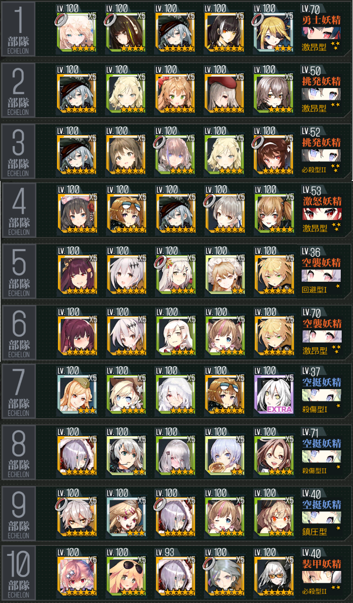
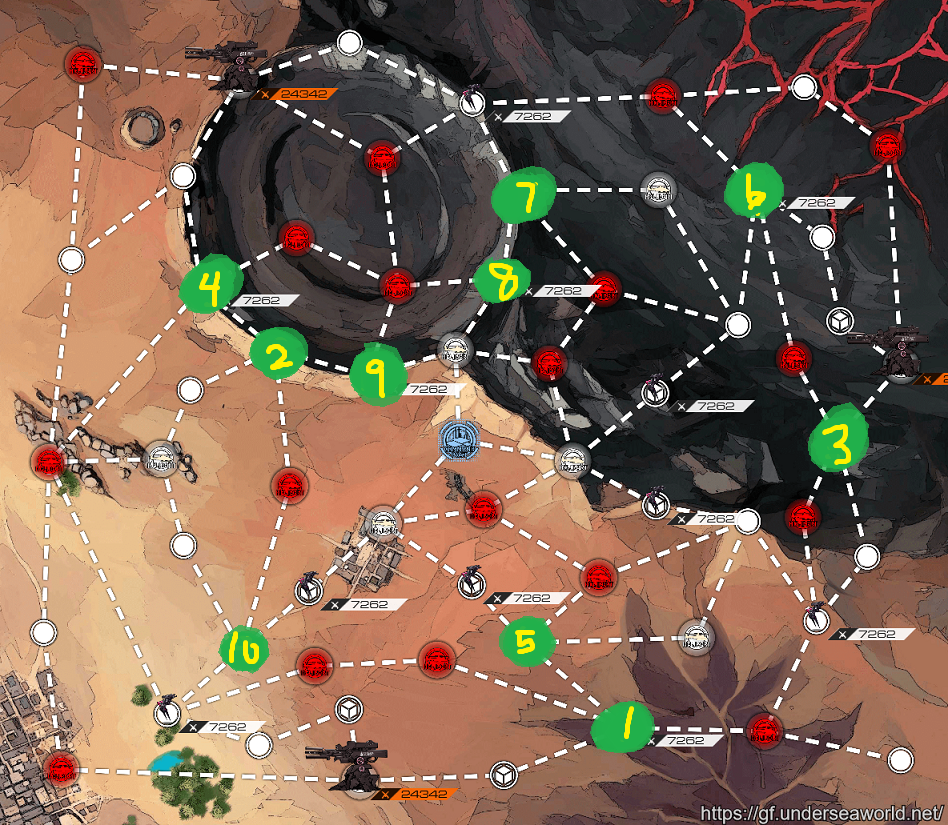

# DD ranking notes
**This is for JP server, Insomer mechanic not applied**

### [General Guide on GFL Corner](https://www.gflcorner.com/dd/)

### [Turn 15 weighted movement](https://docs.google.com/spreadsheets/d/1ea5dU46pK8yegZ5yqLl6vCcmxwivDpSb1gxBukBd700/edit#gid=0)

## Team List

- For text format see this: [(pdf)](docs/dd-ranking.pdf),[(rmd)](docs/dd-ranking.rmd)

## Default Spawning

**Boss spawns:**
- 5/10/20/35
- 50: Architect, get to X formation asap
- 65: Dreamer, avoid row laser
- 80: Gaia, move targeted doll between tiles > retreat
- 100: Garm

## Opening (3 Para strat)
Reset for 5 o'clock Supply point(2 nodes on the right of bottom Jupiter)

## End of 14 (experimental)

## End of 15 (experimental)

