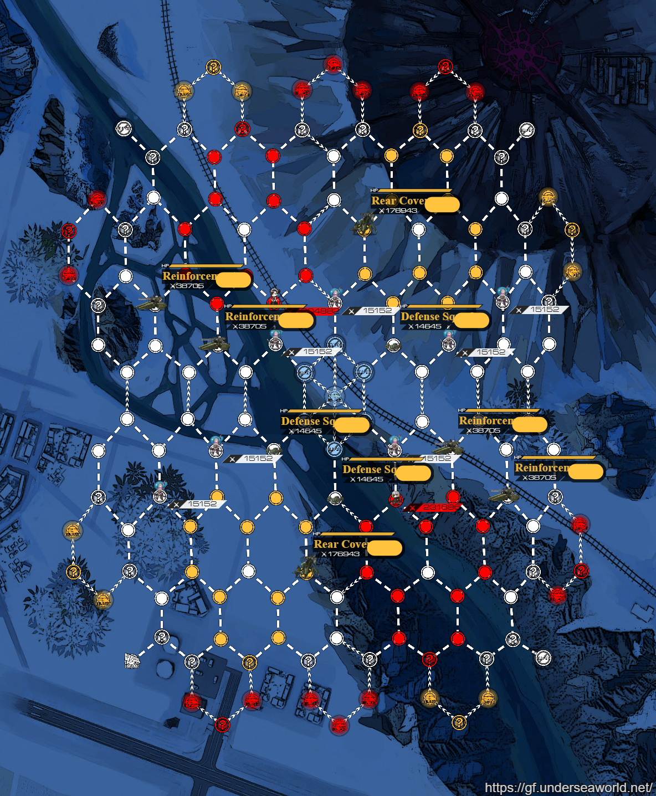

# TOC <a name="toc"></a>
1. [Overall](#overall)
   1. [What the fuck am i looking at and what should i expect ?](#wtf-is-this)
   2. [Orientation](#orientation)
2. [New Mechanics](#new-mechanics)
   1. [New Factions](#new-factions)
   2. [SW Radar](#sw-radar)
   3. [Hydra](#hydra)
   4. [Typhoon](#typhoon)
   5. [Agent Fight](#agent-fight)
3. [Teambuilding](#teambuilding)
4. [Vods](#vods)


# Overall <a name="overall"></a>

Initial locations of the bosses and patrols, as well as their pre-defined routes

#### What the fuck am i looking at and what should i expect ? <a name="wtf-is-this"></a>
  - 45 Jäeger
  - Agent stepping on you
  - <++>placeholder

#### Orientation <a name="orientation"></a>
- Early game
- Midgame
- Late game
  - End game focus is resupplying from nodes, not getting kills necessarily

    Para helps a lot with that -corsage


[Back to TOC](#toc)

# New Mechanics

### New Factions <a name="new-factions"></a>
#### KCCO. Who are they ? <++>placeholder

### SW Radar <a name="sw-radar"></a>
- Stepping into this radar tile will remove all KCCO enemies (excluding the 180k Hydras) from the map. This gimmick will also activate with switches (costs 0 AP) - Ceia

### Hydra <a name="hydra"></a>

### Typhoon <a name="typhoon"></a>
  - Gunboat teams are required, unless <++>placeholder
    - 4 MG + 1 wildcard being anything that has a nuke, e.g Contender, CZ75, Thunder (proofcheck needed)
    - Big 4 dolls are recommended, else dolls that have 3s ICD (LWMMG, M1919A4)
  - After retreating MGs, move wildcard doll to 3 and afk until the tanks are all dead

**Gunboat_team_placeholder**

|[]()| | |
|-|-|-|
|PK|PK| |
|PK|Contender| |
|PK| | |


### Agent Fight <a name="agent-fight"></a>
  - Whole team gets a free shield after every miniboss kill, doesn't expire
  - tactic:
    - EVA dolls: Suomi, MP7 (need to train her mid-event), ro, CMS, PM-06 (not yet in EN)
    - Night ARs

**rec_team_placeholder**

|[]()| | |
|-|-|-|
|AR|Wildcard| |
|HG|SMG| |
|AR| | |

[Back to TOC](#toc)

# Teambuilding <a name="teambuilding"></a>
What you need: lots of FP and the following:

  - Dolls
    - 7 AR teams
    - Night ARs are recommended: OTs-14, 9a-91, T91, T65 (not currently in EN)
    - FP RFs: Lee Enfield, M14, M200, IWS-2000
  - Fairies
    - around 2-69 airstrike
    - 4-20 shield
    - n paradrops
      - Some optimal loadouts:
        - 2 illumine 2 para 2 airstrike 1 shield 3 wildcard
        - 2 illumine 2 para 6 airstrike

  - n for n

```{r eval=FALSE, echo=FALSE}
# WIP AREA
#<++>
#1 Gunboat
#1 Agent team
#4 AR teams
#3 RF teams
#1 SGMG
#
#2 para/illu
#1 warrior/mortar (3 stars)
#3 Airstrike
#1 Chloe
#<++>
#<++>
#2x illumine, 2x para, 3x airstrike (all must be SL10)
#1x warrior, 1x mortar (gunboat)
#1x shield (agent, optional)
#<++> ceia
#<++>
#Tarantula(Arm. Dog)x80 Manticore(Quad Pod)x6
#zas wouldn't do too well here
#might as well sl10 airstrike and have FP ARs finish the job
#Scoutsx20 Ripper(SMG)x15 Vespid(AR)x20
#this node too, might as well airstrike it
#since the vespids have 470 hp
#<++> ceia
#<++>
#Turn 1 use para team to kill agent. Don’t care about losses.
#Turn 2 use 1 illu team to light up top middle/bottom’s 3 SF helipads area, and paradrop the 2 para teams to helipads.
#Turn 3 use the other illu team to light up the other 3 SF helipad area, and retreat both the para teams. Redeploy them and capture SF helipads. (After retreating can repair the team that was used to fight agent).
#Also at the same turn, use other illu team to capture the radar on bottom left.
#Turn 4 and onward have no fixed routes, gotta adapt to the situation.
#<++> ceia
#<++>
#Agent can be defeated whenever, and the only benefit of defeating her early is having the ability to defeat the tanks that spawn near Agent
#And SF bosses score given is static iirc
#Regardless of health loss
#<++> corsage

```

[Back to TOC](#toc)

# Vods <a name="vods"></a>
#### Vod #1, 859k run
</br><iframe width="840" height="480" src="https://www.youtube.com/embed/F2tcHZwSs60" frameborder="0" allowfullscreen></iframe>

___

#### Vod #2, 900k+ run
</br><iframe width="840" height="480" src="https://www.youtube.com/embed/Owc9TYiJyxU" frameborder="0" allowfullscreen></iframe>
</br><iframe width="840" height="480" src="https://www.youtube.com/embed/jcRSDrLDbGU" frameborder="0" allowfullscreen></iframe>
</br><iframe width="840" height="480" src="https://www.youtube.com/embed/27RcI6XiCQY" frameborder="0" allowfullscreen></iframe>

___

#### Vod #3, 800k run
</br><iframe width="840" height="480" src="https://www.youtube.com/embed/vKgIeoLIu84" frameborder="0" allowfullscreen></iframe>
</br><iframe width="840" height="480" src="https://www.youtube.com/embed/1rBx-T8LHr8" frameborder="0" allowfullscreen></iframe>

___

[Back to TOC](#toc)
